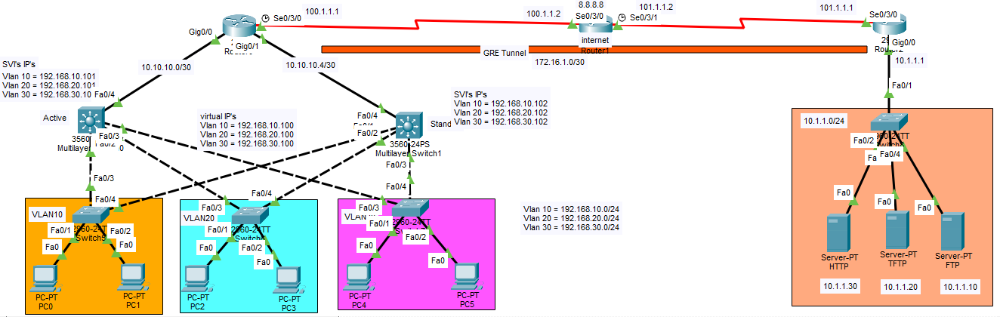
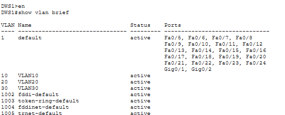
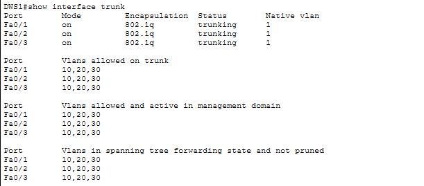
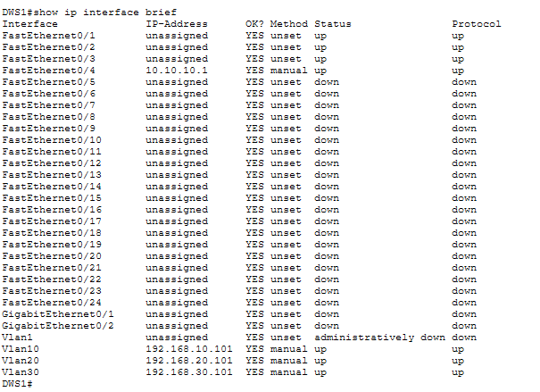
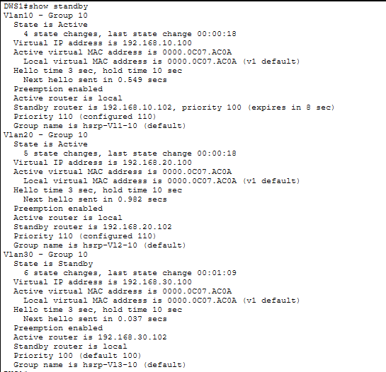
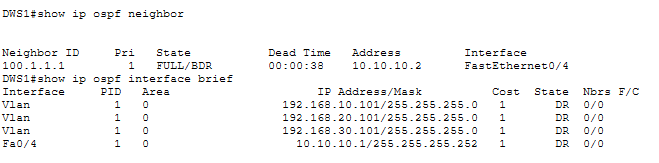
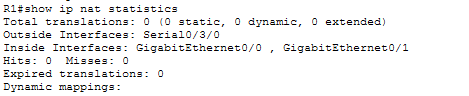
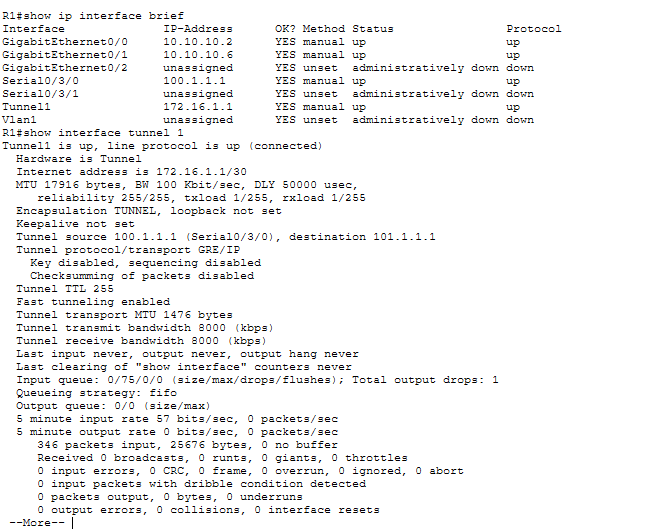
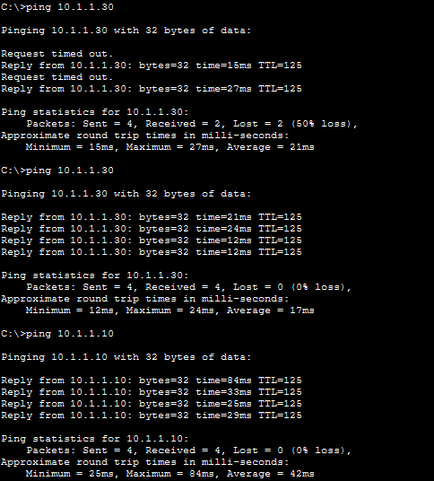
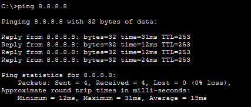

# Enterprise Network Configuration Lab

## 📌 Project Description

Designed and implemented a multi-site enterprise network in Cisco Packet Tracer. The first site contains VLAN-based users, while the second site contains HTTP, FTP, and TFTP servers. Both sites are connected through an ISP network using a GRE tunnel for inter-site communication.

The project implements VLANs, trunking, SVI-based inter-VLAN routing, HSRP gateway redundancy, OSPF dynamic routing, NAT/PAT, and GRE tunneling.

---

## 🌐 Network Topology

The topology represents a multi-site enterprise network with two geographically separated sites connected through an ISP network.



---

## 🔧 Technologies Used

* Cisco Packet Tracer
* VLAN
* 802.1Q Trunking
* DTP
* SVI / Inter-VLAN Routing
* HSRP
* OSPF
* NAT/PAT
* GRE Tunnel
* IPv4
* Cisco IOS CLI

---

## 🏷️ VLAN Configuration

The user site is divided into three VLANs:

| VLAN    | Network         | Virtual Gateway |
| ------- | --------------- | --------------- |
| VLAN 10 | 192.168.10.0/24 | 192.168.10.100  |
| VLAN 20 | 192.168.20.0/24 | 192.168.20.100  |
| VLAN 30 | 192.168.30.0/24 | 192.168.30.100  |



---

## 🔗 Trunk Configuration

Trunk links connect the access switches to the distribution-layer switches and carry multiple VLANs.



---

## 🔀 SVI & Inter-VLAN Routing

SVIs were configured on the distribution-layer multilayer switches to provide Layer 3 gateways and enable communication between VLANs.



---

## 🔄 HSRP

HSRP was implemented to provide redundant default gateways for the VLANs.

* **Distribution Switch 1:** Active
* **Distribution Switch 2:** Standby
* **Virtual Gateway:** `.100` for each VLAN



---

## 🧭 OSPF

OSPF was configured to provide dynamic routing between Layer 3 devices.



---

## 🌍 NAT/PAT

NAT/PAT was configured to provide Internet connectivity to internal users by translating private IP addresses to the appropriate external address.



---

## 🔐 GRE Tunnel

A GRE tunnel was configured between the edge routers of the two sites, allowing users at the VLAN site to communicate with servers at the server site across the ISP network.



---

## 🖥️ Server Services

The server site contains the following services:

* HTTP Server
* FTP Server
* TFTP Server



---

## 🧪 Verification

The following Cisco IOS commands were used to verify the network configuration and operation:

```bash
show vlan brief
show interfaces trunk
show ip interface brief
show standby brief
show ip ospf neighbor
show ip route
show ip nat translations
show ip nat statistics
show interfaces tunnel 0
```



---

## 📁 Project Structure

```text
Enterprise-Network-Configuration-Lab/
│
├── README.md
│
├── Packet-Tracer/
│   └── Enterprise-Network-Configuration.pkt
│
├── Screenshots/
│   ├── Network-Topology.png
│   ├── VLAN-Configuration.png
│   ├── Trunk-Configuration.png
│   ├── SVI-Configuration.png
│   ├── HSRP-Verification.png
│   ├── OSPF-Neighbors.png
│   ├── NAT-PAT-Verification.png
│   ├── GRE-Tunnel.png
│   ├── Inter-Site-Connectivity.png
│   └── Internet-Connectivity.png
│
└── Documentation/
    └── IP-Addressing-Table.pdf
```

---

## 📦 Packet Tracer File

The complete Cisco Packet Tracer network simulation is available below:

[Download Enterprise-Network-Configuration.pkt](packet-tracer/Enterprise-Network-Configuration.pkt)

---

## 📚 Skills Demonstrated

* Enterprise network design
* VLAN segmentation
* 802.1Q trunking
* DTP
* Inter-VLAN routing
* HSRP gateway redundancy
* OSPF dynamic routing
* NAT/PAT
* GRE tunneling
* Network troubleshooting
* Cisco IOS CLI
* Network verification

---

## 👨‍💻 Author

**Saqib Hussain**

BS Information Technology | Networking Enthusiast
